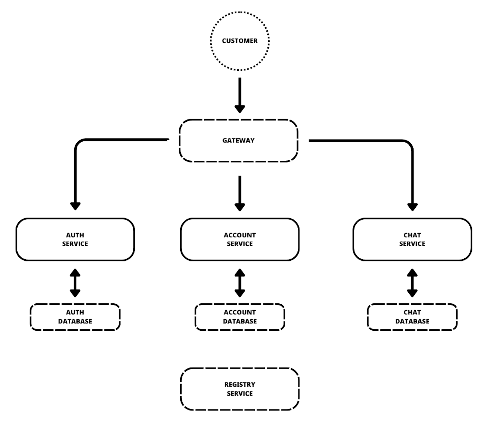

# ChatWave
Chat API in microservice infrastructure.
Still in active development.

## Table of Contents
- [Tech Stack](#tech-stack)
- [Functional Services](#functional-services)
  - [Auth Service](#auth-service)
  - [Account Service](#account-service)
  - [Chat Service](#chat-service)
- [Infrastructure](#infrastructure)
  - [Gateway](#gateway)
  - [Registry](#registry)
- [Common Libraries](#common-libraries)
  - [Auth Client](#auth-client)
  - [Exception](#exception)
- [Run Locally](#run-locally)
- [Author](#author)
- [License](#license)

## Tech Stack
<a id="tech-stack"></a>

`Java` `Spring Boot` `PostgreSQL`

`Docker` `Kubernetes`

## Functional Services
<a id="functional-services"></a>
Chat wave is decomposed into three core microservices. 
All of them have own database and have a different business role.
These micro services only accept and produce json format.




Each endpoint used by users are protected by csrf protection. 
You can disable it by `CSRF_ENABLED` environment variable (however it is not recommended):
This variable is defined in main-configmap.yaml in kubernetes for each microservice.

### Auth Service
<a id="auth-service"></a>

An auth service implements easy client and user authorization system for each microservice.

Clients are authenticated by `client_secret_post` and authorized by `client_credentials`.
New clients are defined in the configuration file like below.
```yaml
app:
  clients:
    - id: micro-service
      secret: secret
      url: http://micro-service-url:port
```

User authorization is session based. Client can create new session for user, then client receives `accessToken` and `refreshToken` which can send to user.
To use `accessToken` we have to send it in `User-Authorization` header with `Bearer ` prefix like below.  
```http
User-Authorization: Bearer accessToken
```

| Method   | Path                                    | Description                                    | Authorization Type |
|:---------|:----------------------------------------|------------------------------------------------|:-------------------|
| `GET`    | `/sessions`                             | Get all not expired sessions of current user   | `USER`             |
| `GET`    | `/session/authentication`               | Get user's authentication data                 | `CLIENT`           |
| `POST`   | `/users`                                | Create a user                                  | `CLIENT`           |
| `POST`   | `/users/authenticate`                   | Authenticate an user                           | `CLIENT`           |
| `POST`   | `/sessions`                             | Create a session for user                      | `CLIENT`           |
| `POST`   | `/sessions/refresh`                     | Refresh accessToken                            | `NONE`             |
| `PUT`    | `/users/{userId}/password`              | Change user's password                         | `CLIENT`           |
| `DELETE` | `/sessions`                             | Expire all user's session                      | `USER`             |
| `DELETE` | `/sessions/{sessionId}`                 | Expire specified session                       | `USER`             |

### Account Service
<a id="account-service"></a>

The accounts service stores non-sensitive user data.

| Method | Path                             | Description                                | Authorization Type |
|:-------|:---------------------------------|--------------------------------------------|:-------------------|
| `GET`  | `/accounts/{accountId}/exist`    | Check that user with given id exist        | `CLIENT`           |
| `GET`  | `/accounts/{accountId}/showcase` | Get account's public information           | `USER`             |
| `POST` | `/accounts`                      | Create an account and user in auth service | `NONE`             |
| `POST` | `/accounts/authenticate`         | Authenticate a user                        | `NONE`             |
| `PATCH`| `/accounts/{accountId}`          | Update user                                | `USER`             |

### Chat Service
<a id="chat-service"></a>
Chat service allows to send and get messages from chat.

| Method | Path                 | Description                                               | Authorization Type |
|:-------|:---------------------|-----------------------------------------------------------|:-------------------|
| `GET`  | `/chat/{memberId}`   | Get few messages from chat before or after specified date | `USER`             |
| `POST` | `/chat/{receiverId}` | Send message to user                                      | `USER`             |

## Infrastructure
<a id="infrastructure"></a>

### Gateway
<a id="gateway"></a>
Gateway introduces easy access from one place to each of the microservices.

### Registry
<a id="registry"></a>
Registry is a simple eureka server application that provides easy communication between services and many useful tools for tracking and managing microservices.

## Common libraries
<a id="common-libraries"></a>

### Auth Client
<a id="auth-client"></a>
Provides filter for user's authorization and UserAuthentication class which represents data of authorized user. 
To use the filter we need to add the following code in SecurityFilterChain:

```java
http.addFilterAt(userAuthFilter, UsernamePasswordAuthenticationFilter.class);
```
Create a feign client:
```java
@FeignClient("auth-service")
public interface AuthService extends com.chatwave.authclient.client.AuthClient {}
```

And set up oauth2 client configuration in config files.
An example of full configuration:

```yaml
spring:
  security:
    oauth2:
      client:
        provider:
          microservices:
            issuer-uri: http://${AUTH_SERVICE_URL}:80
            jwk-set-uri: http://${AUTH_SERVICE_URL}:80/oauth2/jwks
        registration:
          microservices:
            client-id: micro-service
            client-secret: secret
            authorization-grant-type: client_credentials
            client-authentication-method: client_secret_post
            redirect-uri:  "{baseUrl}/login/oauth2/code/spring"
            scope: server, openid
  cloud:
    openfeign:
      oauth2:
        clientRegistrationId: microservices
        enabled: true
```

### Exception
<a id="exception"></a>
The library provides ExceptionHandler for all microservices.
To use this library, we need to add the following annotation to the main class:
```java
@ComponentScan({"com.chatwave.microservice","com.chatwave.exception"})
```

## Run Locally
<a id="run_locally"></a>
Clone the project

```bash
  git clone https://github.com/blackydev/ChatWave
```

Run kubernetes clusters

```bash
  ./ChatWave/k8s-run.sh
```

## Author
<a id="author"></a>
Patryk Likus

[](https://www.linkedin.com/in/patryklikus/)

## License
<a id="license"></a>
All Rights Reserved
